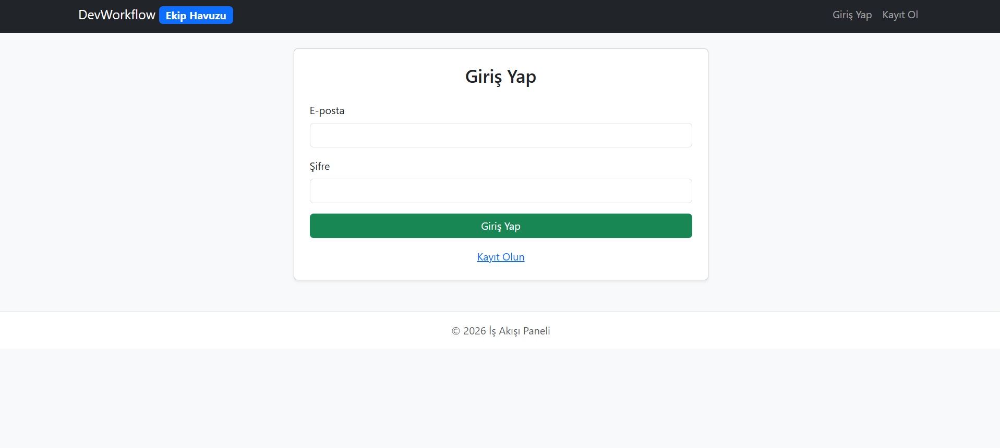
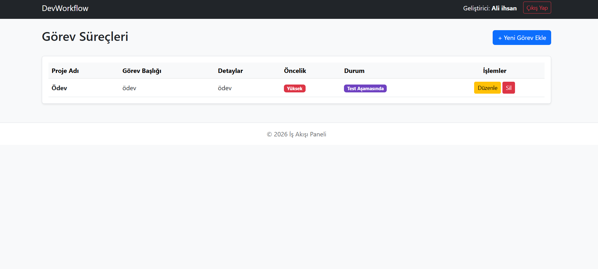

# Yazılım Geliştirme Ekibi İş Akışı Yönetim Sistemi

Bu proje, yazılım geliştirme ekiplerinin üzerinde çalıştıkları projeleri, iş başlıklarını, öncelik derecelerini ve özellikle test süreçlerini tek bir panel üzerinden takip edebilmesi amacıyla geliştirilmiş web tabanlı bir yönetim sistemidir. 

Proje; backend tarafında saf PHP (PDO) ve MySQL, frontend tarafında ise Bootstrap kütüphanesi kullanılarak geliştirilmiştir. Modüler yapının korunması ve yönetim kolaylığı açısından tüm operasyonel süreç tek bir dinamik dosya (`index.php`) üzerinden yönetilmektedir.

## Genel Özellikler

* **Kullanıcı Oturum Yönetimi:** Geliştiriciler sisteme kayıt olabilir ve güvenli bir şekilde giriş/çıkış işlemlerini gerçekleştirebilir. Her kullanıcı sadece kendi oluşturduğu iş süreçlerini görebilir ve yönetebilir.
* **İş Akışı ve CRUD İşlemleri:** Yeni görev ekleme, mevcut görevlerin detaylarını ve öncelik sıralarını düzenleme ile tamamlanan işleri silme süreçleri eksiksiz çalışmaktadır.
* **Test ve Süreç Takibi:** Görevler; "Yapılacak", "Geliştirme Aşamasında", "Test Aşamasında" ve "Tamamlandı" olmak üzere 4 temel aşamada filtrelenerek takip edilmektedir.
* **Dinamik Arayüz:** Bootstrap kullanılarak hazırlanan arayüz, responsive (mobil uyumlu) yapıya sahiptir.

## Veritabanı Mimarisi

Sistem, ilişkisel veritabanı modeli üzerinde iki temel tablo ile çalışmaktadır:

1. **`kullanicilar` Tablosu:** Kullanıcıların temel bilgileri ve `password_hash()` ile şifrelenmiş parola verilerini tutar.
2. **`gorevler` Tablosu:** Görev detaylarını, öncelik ve durum bilgilerini saklar. `kullanici_id` alanı üzerinden kullanıcılar tablosuna yabancı anahtar (FOREIGN KEY - ON DELETE CASCADE) ile bağlıdır.

## Kurulum ve Dağıtım Ayarları

1. Projenin çalışabilmesi için öncelikle veritabanı sunucusunda `dbstorage22360859050` isimli veritabanı oluşturulmalı ve ilgili SQL tablosu kodları aktarılmalıdır.
2. `index.php` dosyasının en başında yer alan veritabanı bağlantı sabitleri (`DB_SERVER`, `DB_USERNAME`, `DB_PASSWORD`, `DB_NAME`) canlı sunucu mimarisine göre yapılandırılmıştır.
3. Sunucu tarafında `public_html` dizini altına yüklenen `index.php` dosyası, URL parametreleri (`action=login`, `action=register`, `action=add`, `action=edit`) üzerinden yönlendirmeleri otomatik olarak yakalamaktadır. 

### 1. Kullanıcı Giriş ve Kayıt Ekranı

### 2. İş Akışı ve Görev Yönetim Paneli

### Sunum videosu linki
https://youtu.be/49XxfZxNGXs

### Web sitesi linki
http://95.130.171.20/~st22360859050
